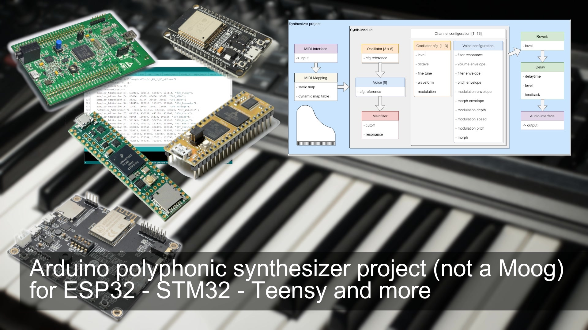
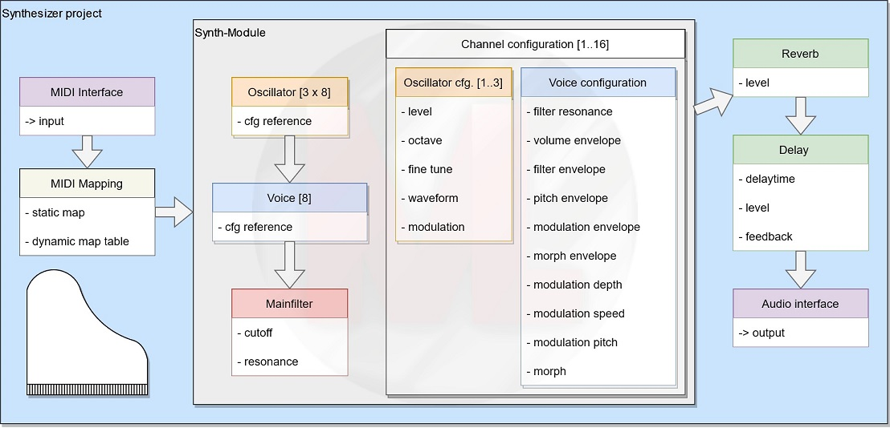

<h1 align="center">ml_synth_basic_example</h1>
<h3 align="center">Arduino polyphonic synthesizer project (not a Moog) for ESP32 - STM32 - Teensy and more</h3>  

 
   
  <a href="https://youtu.be/WJGOIgaY-1s">link to the video</a>

My intention was to make a Moog-like synthesizer.
The result is a bit different but contains some features you might know.
It is a polyphonic Arduino synthesizer project which runs with 3 oscillators per voice.
Tested on the ESP32 it supports 8 voices simultaneously.
Each of the 16 MIDI channels can be configured to generate a unique sound.
Finally the project is not for the ESP32 only. The flexible design allows the support of different platforms like STM32, Teensy etc.
All you hear in this video is directly recorded from the ESP32 Audio Kit without any post processing.

Supported versions of board library
---
- ESP32 version 1.0.6 from https://github.com/espressif/arduino-esp32/releases/tag/1.0.6
- ESP32 version 2.0.2 from https://github.com/espressif/arduino-esp32/releases/tag/2.0.2
Please be aware that other versions might be not supported.

The following images shows the rough architecture of the project:
